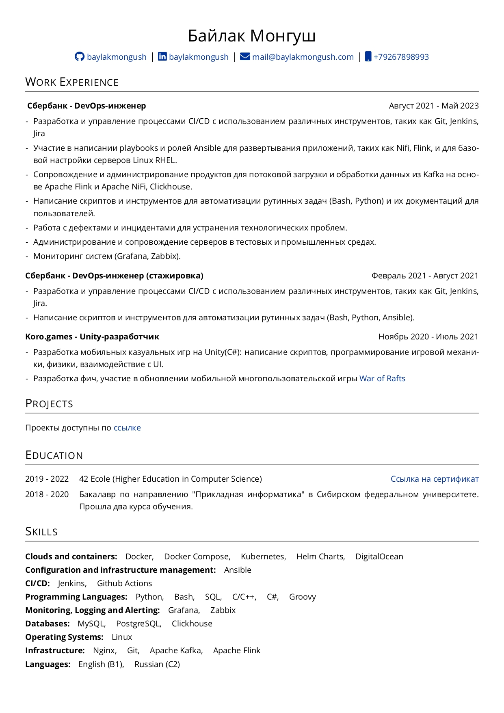

# CV in LaTex

This is my CV written in LaTeX, available in both Russian and English languages.

[//]: # ( )

    
    

### How to generate PDF from source code?

Once Docker is installed, follow the steps below:

* Clone this repository to your local machine:

> git clone https://github.com/baylakmongush/baylakmongush-CV.git

* Navigate to the cloned repository:

> cd baylakmongush-CV

To generate the CV in PDF format, follow these steps:

* Install Docker on your system if it is not already installed.
* Open a terminal and navigate to the root directory of the project.

* Build the Docker image by running the following command:

> docker build -t latex .

* To generate the English version of the CV, run the following command:

> docker run -v `pwd`:/tmp latex pdflatex cv_en.tex citations.bib

The resulting PDF file will be saved in the output directory.

* To generate the Russian version of the CV, run the following command:

>docker run -v `pwd`:/tmp latex pdflatex cv_ru.tex citations.bib

The resulting PDF file will be saved in the output directory.